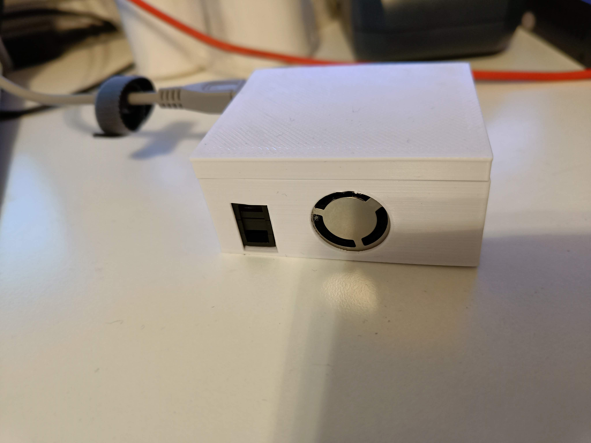

# Sensirion environmental sensor
Sensirion environment sensor project

Sensirion Environmental sensor integration using a esp32 for connecting to wifi, reading out data and sending it out on mqtt.

Simple enclosure to make it into a neat package.

This version uses a nodeMCU or wemos d1 mini esp3286 module.

BOM:  
https://www.sensirion.com/products/catalog/SEN55  ~33$  
https://www.sparkfun.com/products/18079 ~1.5$   
https://en.wikipedia.org/wiki/NodeMCU or https://www.wemos.cc/en/latest/d1/d1_mini_3.1.0.html ~4$
Resistors for i2c pull-up somewhere between 2.2K to 10K should work.

Total BOM cost is ~40$
